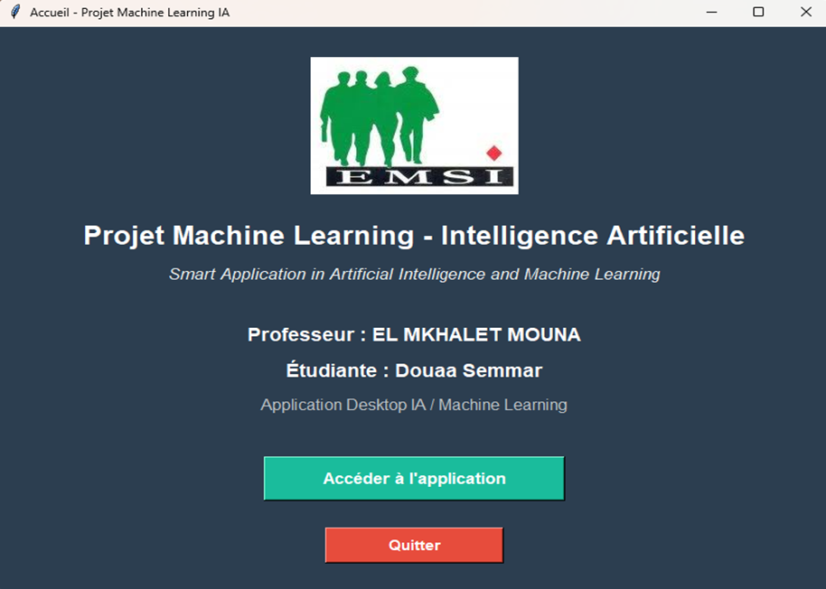
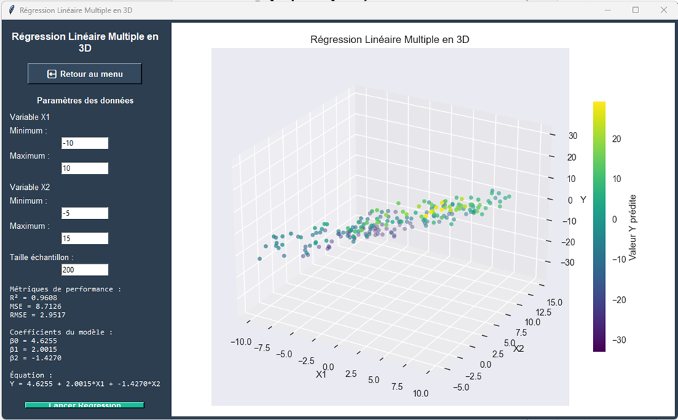
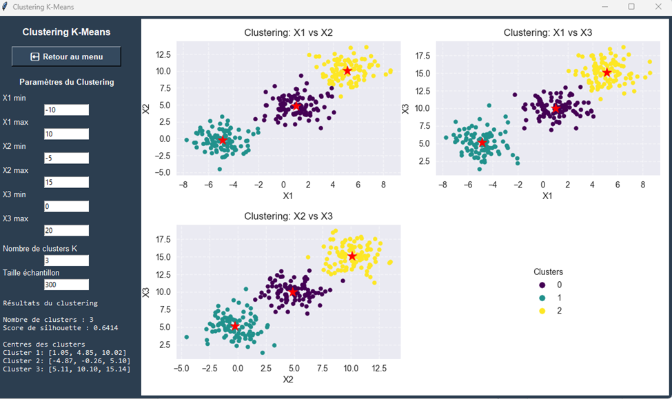
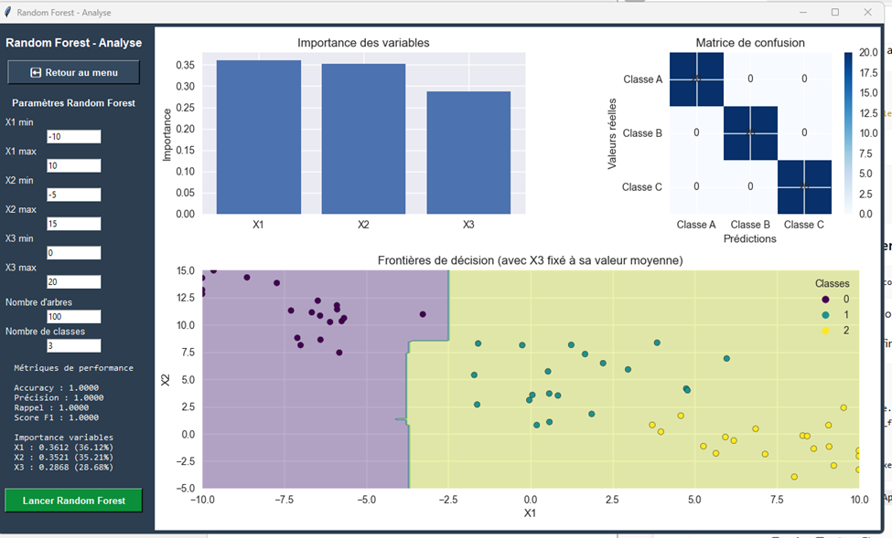
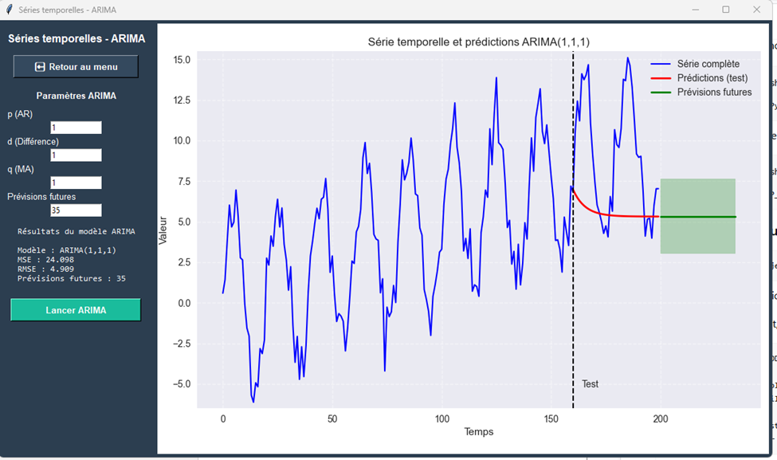
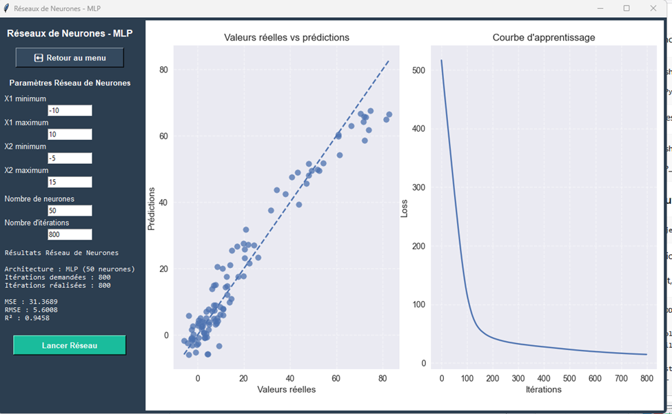
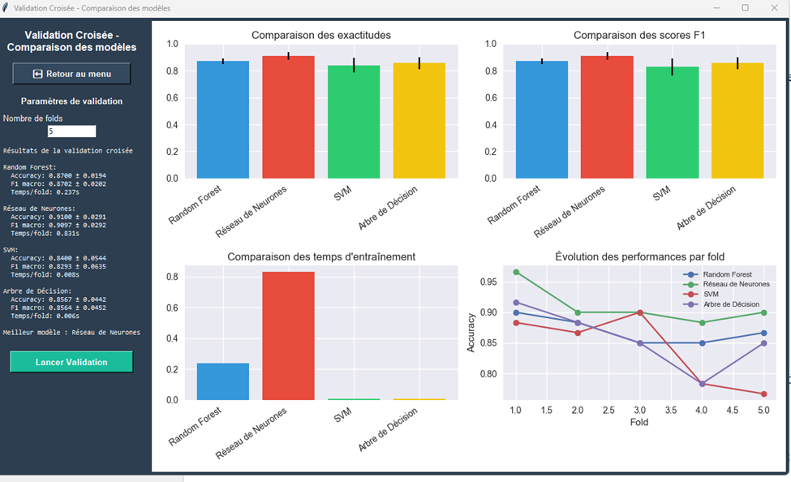

# AI & Machine Learning Desktop Application

Application desktop développée avec Python et Tkinter regroupant plusieurs méthodes d'intelligence artificielle et de Machine Learning.

## Modules

* Régression linéaire multiple
* Clustering K-Means
* Random Forest
* Prévision de séries temporelles avec ARIMA
* Réseau de neurones MLP
* Validation croisée et comparaison de modèles
* Interface globale avec import CSV

## Technologies

* Python
* Tkinter
* NumPy
* Pandas
* Matplotlib
* Scikit-learn
* Statsmodels
* Seaborn

## Installation

```bash
pip install -r requirements.txt
```

## Lancement

Pour ouvrir le menu principal :

```bash
python menu.py
```

Pour ouvrir l'interface avec import CSV :

```bash
python interface.py
```

## Screenshots

### Écran d’accueil



### Régression linéaire multiple



### Clustering K-Means



### Random Forest



### Prévision avec ARIMA



### Réseau de neurones MLP



### Validation croisée et comparaison des modèles



## Structure

```text
ai-machine-learning-desktop-app/
├── menu.py
├── interface.py
├── regression.py
├── clustering.py
├── random_forest.py
├── time_series.py
├── neural_network.py
├── validation.py
├── data.csv
├── requirements.txt
├── .gitignore
└── screenshots/
```

## Auteur

Douaa Semmar
Étudiante en troisième année d'Ingénierie Informatique et Réseaux à l'EMSI
